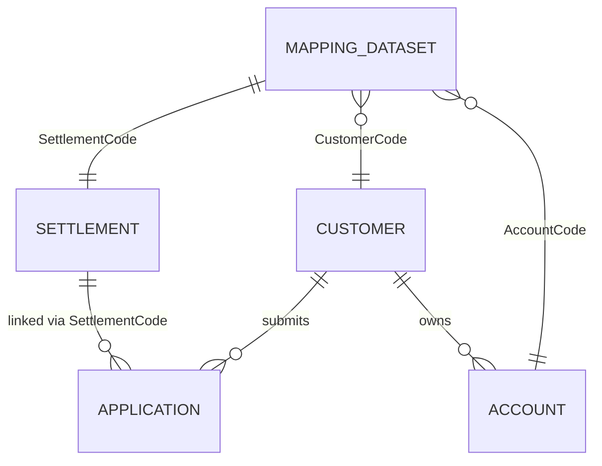

# Database Schema — Settlement Portfolio Data Model

This document describes the **4 core entities** and their relationships from the Excel specification, plus the **recommended physical database design** for wiring the AI Decision Intelligence Agent layer.

For agent capabilities, tool definitions, and business context, see [decision-intelligence-agent-specification.md](./decision-intelligence-agent-specification.md).

---

## Table of Contents

1. [Entity Relationship Diagram](#entity-relationship-diagram-erd)
2. [Mapping Table](#1-mapping-table)
3. [Settlement Table](#2-settlement-table)
4. [Accounts Table](#3-accounts-table)
5. [Applications Table](#4-applications-table)
6. [Recommended Physical Database Design](#recommended-physical-database-design)
7. [AI Agent Integration](#ai-agent-integration)

---

## Entity Relationship Diagram (ERD)

```text
Settlement
    |
    | 1 : 1
    |
Customer
    |
    | 1 : N
    |
Account
    |
    | 1 : N
    |
Application
```

Or more precisely:

```text
SettlementCode
      |
      v
CustomerCode
      |
      +------< AccountCode
      |
      +------< ApplicationCode
```

### Mermaid ERD



---

## 1. Mapping Table

### MappingDataset

This is the **master relationship table**.

| Field          | Type | PK |
| -------------- | ---- | -- |
| SettlementCode | INT  | PK |
| CustomerCode   | INT  | FK |
| AccountCode    | INT  | FK |

### Relationships

```sql
SettlementCode -> CustomerCode
CustomerCode   -> AccountCode
```

### Business Meaning

- One **Settlement** belongs to one **Customer**
- One **Customer** can own many **Accounts**
- **Applications** are linked through `CustomerCode` and `SettlementCode`

---

## 2. Settlement Table

### DatasetSettlements

#### Primary Key

```sql
SettlementCode
```

#### Foreign Key

```sql
CustomerCode
```

---

### References

| Column          | Type        |
| --------------- | ----------- |
| RefYearMonth    | NVARCHAR(6) |
| referenceDate   | DATE        |
| LastWorkingDate | DATE        |
| PortfolioName   | VARCHAR     |

---

### Settlement Information

| Column                    | Type    |
| ------------------------- | ------- |
| SettlementStatus          | VARCHAR |
| SettlementStatusDate      | DATE    |
| SettlementCreated         | DATE    |
| SettlementActivationDate  | DATE    |
| SettlementCurrentMonth    | INT     |
| SettlementDuration        | INT     |
| SettlementNrInstallments  | INT     |
| SettlementAmount          | FLOAT   |
| SettlementPrincipalAmount | FLOAT   |
| SettlementRemainingAmount | FLOAT   |
| SettlementDiscountAmount  | FLOAT   |
| SettlementDownPaymentAmnt | FLOAT   |
| SettlementKeptPercentage  | FLOAT   |
| SettlementTypeDescription | VARCHAR |
| SettlementArrearsDays     | INT     |
| SettlementBucket          | INT     |
| SettlementArrearsAmount   | FLOAT   |
| SettlementPaidAmount      | FLOAT   |
| PastInstallmentsAmnt      | FLOAT   |

---

### Connected Account Aggregates

| Column                          | Type  |
| ------------------------------- | ----- |
| ConnectedLoans                  | INT   |
| TotalBalanceConnectedLoans      | FLOAT |
| AccountingBalanceConnectedLoans | FLOAT |
| WrittenOffAmountConnectedLoans  | FLOAT |
| PrincipalAmountConnectedLoans   | FLOAT |

---

### Channel Information

| Column                | Type    |
| --------------------- | ------- |
| AssignmentChannelName | VARCHAR |
| ChannelGroup          | VARCHAR |
| SBProducts            | INT     |
| CLProducts            | INT     |
| CCProducts            | INT     |

---

### Customer Information

| Column                 | Type    |
| ---------------------- | ------- |
| BirthDate              | DATE    |
| Age                    | INT     |
| FlagDeceased           | INT     |
| FlagLegalEntity        | INT     |
| FlagCompanyIsActive    | INT     |
| LegalEntityType        | INT     |
| postCode               | INT     |
| Nomos                  | VARCHAR |
| Region                 | VARCHAR |
| Occupation             | VARCHAR |
| CustomerType           | VARCHAR |
| AMLRisk                | VARCHAR |
| Segment                | VARCHAR |
| FlagCampaign           | INT     |
| FlagCorporate          | INT     |
| FlagLegal              | INT     |
| FlagUnderLawProtection | INT     |
| VulnerabilityStatus    | VARCHAR |

---

### Payment Features

| Column             | Type  |
| ------------------ | ----- |
| Payments6M         | FLOAT |
| EarlierPaymentDate | DATE  |
| EarlierPaymentDays | INT   |
| latestPaymentDate  | DATE  |
| latestPaymentDays  | INT   |
| PaymentsWindow6M   | INT   |

---

### Activity Features

| Column                         | Type    |
| ------------------------------ | ------- |
| LatestActivityDate             | DATE    |
| daysFromLastActivity           | INT     |
| LatestActiivyType              | VARCHAR |
| LatestContactType              | VARCHAR |
| ActivityDays3M                 | INT     |
| CCAActivities3M                | INT     |
| NFCTPActivities3M              | INT     |
| CAPTActivities3M               | INT     |
| NFCT_RPCActivities3M           | INT     |
| NFCT_REFActivities3M           | INT     |
| NFCT_REVActivities3M           | INT     |
| NFCT_PTPActivities3M           | INT     |
| NFCTActivities3M               | INT     |
| smsActivities3M                | INT     |
| NoContactActivities3M          | INT     |
| ThirdPersonContactActivities3M | INT     |
| RightPartyContactActivities3M  | INT     |
| WrongPersonContactActivities3M | INT     |
| LetterActivities3M             | INT     |

---

## 3. Accounts Table

### DatasetAccounts

#### Primary Key

```sql
AccountCode
```

#### Foreign Key

```sql
CustomerCode
```

---

### Account Information

| Column              | Type    |
| ------------------- | ------- |
| DPD                 | INT     |
| Bucket              | INT     |
| DenouncementAmount  | FLOAT   |
| DebtAmount          | FLOAT   |
| TotalBalance        | FLOAT   |
| AccountingBalance   | FLOAT   |
| WrittenOffAmount    | FLOAT   |
| PrincipalAmount     | FLOAT   |
| InterestCustomType  | VARCHAR |
| AccountOpenDate     | DATE    |
| AccountCurrentMonth | INT     |
| FixedRate           | FLOAT   |
| TotalInterestRate   | FLOAT   |
| Spread              | FLOAT   |

---

### Business Dimensions

| Column                | Type    |
| --------------------- | ------- |
| AssignmentChannelName | VARCHAR |
| ChannelGroup          | VARCHAR |
| BusinessUnit          | VARCHAR |
| Product               | VARCHAR |

---

### Customer, Payment, and Activity Fields

The Account table duplicates the same **customer**, **payment**, and **activity** dimensions found in Settlements.

This suggests:

```text
Account Snapshot Dataset
```

used for feature engineering.

---

## 4. Applications Table

### DatasetApplications

#### Primary Key

```sql
ApplicationCode
```

#### Foreign Keys

```sql
CustomerCode
SettlementCode
```

`AccountCode` exists in source data but the specification notes:

> **"does not exist"**

meaning it should **not** be considered a trusted FK.

---

### Identification

| Column          | Type |
| --------------- | ---- |
| ApplicationCode | INT  |
| CustomerCode    | INT  |
| CustomerID      | INT  |
| SettlementCode  | INT  |

---

### Portfolio Information

| Column          | Type    |
| --------------- | ------- |
| Portfolio       | VARCHAR |
| PortfolioGroup  | VARCHAR |
| CustomerSegment | VARCHAR |

---

### Workflow Information

| Column                     | Type    |
| -------------------------- | ------- |
| ApplicationStatus          | VARCHAR |
| PipelineStatus             | VARCHAR |
| QCApplicationStatus        | VARCHAR |
| CurrentStage               | VARCHAR |
| CurrentStageStartDate      | DATE    |
| CurrentStageOrderInProcess | VARCHAR |
| CurrentStep                | VARCHAR |

---

### Timeline

| Column             | Type |
| ------------------ | ---- |
| StartDate          | DATE |
| CreationDate       | DATE |
| SubmissionDate     | DATE |
| ApprovalDate       | DATE |
| ImplementationDate | DATE |
| ActivationDate     | DATE |
| CancellationDate   | DATE |
| RejectionDate      | DATE |
| EndDate            | DATE |

---

### Officer / Channel

| Column                  | Type    |
| ----------------------- | ------- |
| AssignedOfficer         | VARCHAR |
| ApplicationOfficer      | VARCHAR |
| ApplicationCreator      | VARCHAR |
| AssignmentChannel       | VARCHAR |
| ApplicationChannel      | VARCHAR |
| ApplicationChannelGroup | VARCHAR |

---

### Financial Terms (Initial Offer)

| Column                     | Type    |
| -------------------------- | ------- |
| InitialTenor               | INT     |
| InitialInterestRate        | FLOAT   |
| InitialInstallmentAmount   | FLOAT   |
| InitialHaircutAmount       | FLOAT   |
| InitialDownpaymentAmount   | FLOAT   |
| InitialRestructuringAmount | FLOAT   |
| InitialSolutionType        | VARCHAR |

---

### Counter Proposal

| Column                             | Type  |
| ---------------------------------- | ----- |
| CounterProposalInstallment         | FLOAT |
| CounterProposalHaircutAmount       | FLOAT |
| CounterProposalRestructuringAmount | FLOAT |
| CounterProposalDownpayment         | FLOAT |

---

### Final Approved Terms

| Column                   | Type    |
| ------------------------ | ------- |
| FinalTenor               | INT     |
| FinalInterestRate        | FLOAT   |
| FinalInstallmentAmount   | FLOAT   |
| FinalHaircutAmount       | FLOAT   |
| FinalDownpaymentAmount   | FLOAT   |
| FinalRestructuringAmount | FLOAT   |
| FinalSolutionType        | VARCHAR |

---

### Settlement Information

| Column           | Type  |
| ---------------- | ----- |
| SettlementCode   | INT   |
| SettlementAmount | FLOAT |
| FlagLaw          | INT   |

---

## Recommended Physical Database Design

For the AI Agent project, normalize the source datasets into the following schema.

### Dimension Tables

```sql
dim_customer
dim_region
dim_channel
dim_product
dim_portfolio
```

| Table         | Purpose                                              |
| ------------- | ---------------------------------------------------- |
| dim_customer  | Customer demographics, flags, segment, vulnerability |
| dim_region    | Geographic hierarchy (postCode, Nomos, Region)       |
| dim_channel   | Assignment and application channel dimensions        |
| dim_product   | Product and business unit taxonomy                   |
| dim_portfolio | Portfolio and portfolio group reference data         |

---

### Fact Tables

```sql
fact_accounts_monthly
fact_settlements_monthly
fact_applications
fact_payments
fact_activities
```

| Table                    | Source / Role                                           |
| ------------------------ | ------------------------------------------------------- |
| fact_accounts_monthly    | `DatasetAccounts` — account-level balances and features |
| fact_settlements_monthly | `DatasetSettlements` — settlement terms and status    |
| fact_applications        | `DatasetApplications` — workflow and offer lifecycle    |
| fact_payments            | `PaymentsDataset` — payment history for PoF features    |
| fact_activities          | CRM / contact activity counts and recency               |

---

### Bridge / Mapping Table

```sql
bridge_settlement_customer_account   -- from MappingDataset
```

| Column         | Type | Notes                    |
| -------------- | ---- | ------------------------ |
| SettlementCode | INT  | PK component             |
| CustomerCode   | INT  | FK → dim_customer        |
| AccountCode    | INT  | FK → fact_accounts_monthly |

---

### AI / Optimization Tables

```sql
fact_offer_grid_scores
fact_recommended_offers
fact_efficient_frontier
fact_model_monitoring
fact_shap_explanations
```

| Table                    | Source Dataset                  | Agent Tool |
| ------------------------ | ------------------------------- | ---------- |
| fact_offer_grid_scores   | `prescored_borrower_offer_grid` | T2         |
| fact_recommended_offers  | `recommended_offers_3l_v3`    | T2, T1     |
| fact_efficient_frontier  | `efficient_frontier`            | T4         |
| fact_model_monitoring    | `monitoring_baselines`          | T5         |
| fact_shap_explanations   | Model bundles / SHAP outputs    | T6         |

#### fact_offer_grid_scores (illustrative)

| Column           | Type    | Description                          |
| ---------------- | ------- | ------------------------------------ |
| CustomerCode     | INT     | FK                                   |
| SettlementCode   | INT     | FK                                   |
| RecoveryRate     | FLOAT   | Offer recovery rate                  |
| Installments     | INT     | Number of installments               |
| P_Application    | FLOAT   | PoAPP score                          |
| P_Acceptance     | FLOAT   | PoA / PoC score                      |
| P_Fulfillment    | FLOAT   | PoF score                            |
| ExpectedValue    | FLOAT   | Computed EV                          |
| ModelVersion     | VARCHAR | Model bundle version                 |
| ScoredAt         | DATE    | Batch scoring timestamp              |

#### fact_recommended_offers (illustrative)

| Column           | Type    | Description                    |
| ---------------- | ------- | ------------------------------ |
| CustomerCode     | INT     | FK                             |
| SettlementCode   | INT     | FK                             |
| OptimalRR        | FLOAT   | MILP-selected recovery rate    |
| OptimalInstallments | INT  | MILP-selected installments   |
| ExpectedValue    | FLOAT   | Optimal EV                     |
| MIPGap           | FLOAT   | Optimizer gap                  |
| RefYearMonth     | NVARCHAR(6) | Monthly batch reference    |
| ModelVersion     | VARCHAR | Optimizer + model version      |

#### fact_model_monitoring (illustrative)

| Column        | Type    | Description              |
| ------------- | ------- | ------------------------ |
| ModelName     | VARCHAR | PoAPP, PoA, PoF, etc.    |
| MetricName    | VARCHAR | PSI, drift, calibration  |
| MetricValue   | FLOAT   | Observed value           |
| BaselineValue | FLOAT   | From monitoring_baselines|
| RefYearMonth  | NVARCHAR(6) | Reference period       |
| AlertFlag     | BOOLEAN | Threshold breach         |

#### fact_shap_explanations (illustrative)

| Column         | Type    | Description                |
| -------------- | ------- | -------------------------- |
| CustomerCode   | INT     | FK                         |
| ModelName      | VARCHAR | PoA_v3.1, etc.             |
| FeatureName    | VARCHAR | SHAP feature               |
| ShapValue      | FLOAT   | Contribution to prediction |
| Direction      | VARCHAR | positive / negative        |
| ScoredAt       | DATE    | Explanation timestamp      |

---

### Audit & Agent Tables

```sql
agent_conversations
agent_tool_calls
agent_recommendations
agent_audit_trail
```

| Table                  | Purpose                                           |
| ---------------------- | ------------------------------------------------- |
| agent_conversations    | User sessions, prompts, and agent responses       |
| agent_tool_calls       | Structured log of every tool invocation           |
| agent_recommendations  | Persisted recommendations with full reconstruction|
| agent_audit_trail      | Compliance events, guardrail outcomes, RBAC     |

#### agent_conversations (illustrative)

| Column           | Type      | Description              |
| ---------------- | --------- | ------------------------ |
| conversation_id  | UUID      | PK                       |
| user_id          | VARCHAR   | RBAC subject             |
| started_at       | TIMESTAMP | Session start            |
| ended_at         | TIMESTAMP | Session end              |
| domain           | VARCHAR   | portfolio / settlement / economic |

#### agent_tool_calls (illustrative)

| Column           | Type      | Description                    |
| ---------------- | --------- | -------------------------------- |
| tool_call_id     | UUID      | PK                               |
| conversation_id  | UUID      | FK → agent_conversations         |
| tool_name        | VARCHAR   | T1–T6 identifier                 |
| input_payload    | JSONB     | Tool input                       |
| output_payload   | JSONB     | Tool output                      |
| executed_at      | TIMESTAMP | Execution time                   |
| duration_ms      | INT       | Latency                          |

#### agent_recommendations (illustrative)

| Column              | Type    | Description                         |
| ------------------- | ------- | ----------------------------------- |
| recommendation_id   | UUID    | PK                                  |
| conversation_id     | UUID    | FK                                  |
| customer_code       | INT     | Target borrower                     |
| settlement_code     | INT     | Target settlement                   |
| recommended_rr      | FLOAT   | Suggested recovery rate             |
| recommended_installments | INT | Suggested installments              |
| expected_value      | FLOAT   | EV at recommendation time           |
| p_application       | FLOAT   | PoAPP                               |
| p_acceptance        | FLOAT   | PoA                                 |
| p_fulfillment       | FLOAT   | PoF                                 |
| model_version       | VARCHAR | Model bundle used                   |
| mip_gap             | FLOAT   | Optimizer gap                       |
| guardrail_passed    | BOOLEAN | Deterministic compliance result     |
| created_at          | TIMESTAMP | Recommendation timestamp          |

#### agent_audit_trail (illustrative)

| Column        | Type      | Description                              |
| ------------- | --------- | ---------------------------------------- |
| audit_id      | UUID      | PK                                       |
| event_type    | VARCHAR   | guardrail_block, recommendation, query   |
| actor_id      | VARCHAR   | User or system                           |
| entity_type   | VARCHAR   | customer, settlement, application        |
| entity_id     | VARCHAR   | Code or composite key                    |
| event_payload | JSONB     | Full event detail for reconstruction     |
| created_at    | TIMESTAMP | Event time                               |

---

## AI Agent Integration

This schema directly supports the six agent tools defined in the specification.

| Tool | Name                | Primary Tables                                              |
| ---- | ------------------- | ----------------------------------------------------------- |
| T1   | Borrower Lookup     | `dim_customer`, `fact_settlements_monthly`, `fact_recommended_offers`, `bridge_settlement_customer_account` |
| T2   | Offer Optimization  | `fact_offer_grid_scores`, `fact_recommended_offers`          |
| T3   | Portfolio Analytics | `fact_settlements_monthly`, `fact_applications`, `fact_payments`, `fact_model_monitoring` |
| T4   | Frontier Analysis   | `fact_efficient_frontier`, `fact_offer_grid_scores`         |
| T5   | Monitoring          | `fact_model_monitoring`                                     |
| T6   | Explainability      | `fact_shap_explanations`                                    |

### Guardrail Fields (Deterministic Checks)

These columns from `DatasetSettlements` / `dim_customer` feed **pre-LLM guardrails**:

| Field                  | Guardrail Rule                          |
| ---------------------- | --------------------------------------- |
| FlagDeceased           | Block recommendation; escalate workflow |
| FlagLegalEntity        | Route to corporate collections workflow |
| SettlementKeptPercentage | Enforce RR within regulatory bounds   |
| FlagUnderLawProtection | Block or restrict recommendations       |
| VulnerabilityStatus    | Apply vulnerability handling policy     |

### Entity Join Path for Borrower Lookup

```sql
-- Resolve borrower context by CustomerCode or SettlementCode
SELECT
    m.SettlementCode,
    m.CustomerCode,
    m.AccountCode,
    s.SettlementAmount,
    s.SettlementNrInstallments,
    s.SettlementKeptPercentage,
    c.FlagDeceased,
    c.FlagLegalEntity,
    r.OptimalRR,
    r.OptimalInstallments,
    r.ExpectedValue
FROM bridge_settlement_customer_account m
JOIN fact_settlements_monthly s ON s.SettlementCode = m.SettlementCode
JOIN dim_customer c ON c.CustomerCode = m.CustomerCode
LEFT JOIN fact_recommended_offers r
    ON r.CustomerCode = m.CustomerCode
   AND r.SettlementCode = m.SettlementCode;
```

---

## Summary

The data model centers on **four core entities** — Settlement, Customer, Account, and Application — linked through `MappingDataset` and foreign keys on `CustomerCode` and `SettlementCode`.

The recommended physical design separates:

- **Dimensions** for stable reference data
- **Facts** for monthly snapshots, applications, payments, and activities
- **AI/optimization tables** for prescored grids, MILP outputs, frontier curves, monitoring, and SHAP
- **Agent audit tables** for full recommendation reconstruction and compliance

This structure is the data foundation the AI agent layer queries through its tool router — the LLM orchestrates reads and simulations; it does not own the calculations or compliance logic.
