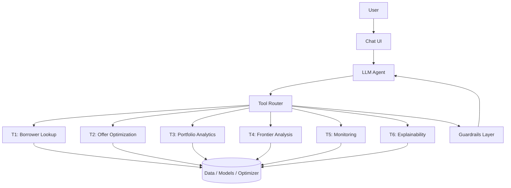

# AI-Powered Decision Intelligence Agent for Debt Settlement Portfolios

## Overview

This specification describes an **AI-powered Decision Intelligence Agent for debt settlement portfolios**. The goal is not to create another predictive model, but rather to build an **intelligent conversational layer on top of existing machine learning models, optimization engines, and portfolio data**.

Think of it as a **Bloomberg Terminal + ChatGPT for Collections & Settlement Management**.

---

## Table of Contents

1. [Business Context](#1-business-context)
2. [Existing Predictive Models](#2-existing-predictive-models)
3. [Expected Value (EV)](#3-expected-value-ev)
4. [Optimization Engine (MILP)](#4-optimization-engine-milp)
5. [Three Business Domains](#5-three-business-domains)
6. [Efficient Frontier](#6-efficient-frontier)
7. [Agent Architecture](#7-agent-architecture)
8. [Required Agent Tools](#8-required-agent-tools)
9. [Multi-Turn Reasoning Example](#9-multi-turn-reasoning-example)
10. [Guardrails (Critical)](#10-guardrails-critical)
11. [Uncertainty & Model Risk](#11-uncertainty--model-risk)
12. [Explainability Requirements](#12-explainability-requirements)
13. [Data Sources Explained](#13-data-sources-explained)
14. [What the Client Actually Wants](#14-what-the-client-actually-wants)
15. [Recommended Modern Architecture](#15-recommended-modern-architecture)

---

## 1. Business Context

The company manages a portfolio of borrowers who owe money.

For each borrower, they need to answer questions such as:

- Should we contact this borrower?
- What settlement offer should we propose?
- How likely are they to accept?
- If they accept, how likely are they to pay?
- Which settlement strategy maximizes portfolio value?

Currently these answers come from:

- Predictive models
- Optimization notebooks
- Data analysts running Python scripts
- Monthly batch processes

The objective is to replace all this complexity with:

> **"Ask a question in plain English and receive a model-backed answer instantly."**

### Example Interaction

**Analyst asks:**

> What settlement should we offer borrower 243445?

**Agent answers:**

> Offer 60% Recovery Rate over 2 installments.
>
> Expected Value = £1,425
>
> Probability of Application = 78%
>
> Probability of Acceptance = 64%
>
> Probability of Fulfillment = 85%
>
> Portfolio constraints satisfied.
>
> Model Version = v3.2

---

## 2. Existing Predictive Models

The entire system revolves around three predictive models.

### Model 1: PoAPP — Application Propensity Model

**Question:**

> If we contact this borrower, how likely are they to apply?

**Output:**

```
P(Application)
```

**Example:**

```
78%
```

---

### Model 2: PoA / PoC — Probability of Acceptance

**Question:**

> If the borrower receives the offer, how likely are they to accept it?

**Output:**

```
P(Acceptance)
```

**Example:**

```
64%
```

---

### Model 3: PoF — Probability of Fulfillment

**Question:**

> If the borrower accepts the settlement, how likely are they to complete payment?

**Output:**

```
P(Fulfillment)
```

**Example:**

```
85%
```

Usually implemented with:

- Random Survival Forest (RSF)
- Survival Analysis

because payment occurs over time.

---

## 3. Expected Value (EV)

The business objective is maximizing Expected Value.

### Formula

```
EV = P_App × P_Accept × P_Fulfill × Settlement Amount
```

### Example

**Outstanding Balance:**

```
£10,000
```

**Settlement Offer:**

```
£6,000
```

**Predictions:**

```
P(App)    = 0.8
P(Accept) = 0.6
P(Fulfill) = 0.9
```

**EV:**

```
0.8 × 0.6 × 0.9 × 6000 = £2,592
```

**Meaning:**

> On average this offer is expected to generate £2,592 value.

---

## 4. Optimization Engine (MILP)

The company already runs an optimizer.

**MILP** = Mixed Integer Linear Programming.

The optimizer evaluates:

| Recovery Rate | Installments |
| ------------- | ------------ |
| 20%           | 1            |
| 20%           | 2            |
| 20%           | 3            |
| 40%           | 1            |
| 40%           | 2            |
| 40%           | 3            |
| 60%           | 1            |
| 60%           | 2            |
| 60%           | 3            |

For every combination it calculates:

```
EV
```

Then selects:

```
Best Settlement Assignment
```

### Example

| Offer                    | EV     |
| ------------------------ | ------ |
| 40% RR / 1 Installment   | £800   |
| 60% RR / 2 Installments  | £1,425 |
| 70% RR / 3 Installments  | £1,100 |

**Optimizer chooses:**

```
60% RR / 2 Installments
```

because EV is highest.

---

## 5. Three Business Domains

The AI agent must answer questions across three domains.

---

### Domain 1: Portfolio Performance

**Executive Dashboard Questions**

Examples:

- Current EV vs Actual Collections
- How is realization rate changing?
- Which segments are underperforming?
- Show drift against baseline.

**Data comes from:**

- Portfolio KPIs
- Monitoring baselines
- CRM outcomes

**Audience:**

- Management
- Portfolio Managers
- Directors

---

### Domain 2: Settlement Assignment

**Operational Questions**

Examples:

- What should we offer borrower 243445?
- Why was 60% RR chosen?
- What if we move from 2 installments to 1?

**Audience:**

- Collections Analysts
- Contact Centre Teams

---

### Domain 3: Economic Terms Analysis

**Strategic Questions**

Examples:

- What if fulfillment probability must be at least 70%?
- What happens if maximum RR is capped at 50%?
- Show efficient frontier.

**Audience:**

- Quant Team
- Strategy Team
- Risk Team

---

## 6. Efficient Frontier

This comes from optimization theory.

The frontier shows:

```
Risk vs Reward
```

or

```
Portfolio Value vs Portfolio Risk
```

### Example

| Strategy     | EV    | Risk   |
| ------------ | ----- | ------ |
| Conservative | £5M   | Low    |
| Balanced     | £7M   | Medium |
| Aggressive   | £8.5M | High   |

The agent should explain:

> If we require P(Fulfill) ≥ 70%, portfolio EV decreases by 8% but risk reduces by 15%.

---

## 7. Agent Architecture

The architecture follows a classic Agentic AI pattern.

```text
User
  ↓
Chat UI
  ↓
LLM Agent
  ↓
Tool Router
  ↓
Data / Models / Optimizer
```

The LLM does not calculate itself.

It orchestrates tools.

### Architecture Diagram



---

## 8. Required Agent Tools

Design at least six tools.

### T1: Borrower Lookup Tool

Retrieve:

- Borrower profile
- Outstanding balance
- Current offer
- Predicted probabilities

**Example:**

> Tell me about borrower 243445

---

### T2: Offer Optimization Tool

Calls MILP.

Returns:

- Optimal RR
- Installments
- EV

---

### T3: Portfolio Analytics Tool

Returns:

- Portfolio KPIs
- Monthly trends
- Drift metrics

---

### T4: Frontier Analysis Tool

Scenario simulations.

**Examples:**

- Apply P(Fulfill) > 0.8
- Restrict RR to 50%

---

### T5: Monitoring Tool

Model health:

- Drift
- PSI
- Stability
- Calibration

---

### T6: Explainability Tool

SHAP-based explanations.

**Example:**

> Why is acceptance probability low?

**Returns:**

```text
Top negative features:
- Recent missed payments
- Long delinquency
- Low previous engagement
```

### Tool Summary

| Tool | Name                  | Primary Use Case                          |
| ---- | --------------------- | ----------------------------------------- |
| T1   | Borrower Lookup       | Individual borrower profile and scores    |
| T2   | Offer Optimization    | MILP-based optimal settlement assignment  |
| T3   | Portfolio Analytics   | KPIs, trends, segment performance         |
| T4   | Frontier Analysis     | What-if scenarios and constraint analysis |
| T5   | Monitoring            | Model health, drift, PSI, calibration     |
| T6   | Explainability        | SHAP drivers for prediction explanations  |

---

## 9. Multi-Turn Reasoning Example

**User:**

> Show top 5 borrowers where changing from 2 installments to 1 installment increases EV.

### Agent Workflow

#### Step 1 — Query Portfolio (T3)

Query portfolio-level data to identify candidate borrowers.

↓

#### Step 2 — Retrieve Borrowers

Fetch borrower records and current settlement assignments.

↓

#### Step 3 — Run Optimization Comparison (T2)

Run optimization for both scenarios (2 installments vs 1 installment).

↓

#### Step 4 — Rank EV Difference

Compute and rank the EV delta across borrowers.

↓

#### Step 5 — Return Results

Present top 5 borrowers with EV improvement, probabilities, and model metadata.

### Tool Chain

```
T3 → T2 → T6
```

The agent chains tools together for complex, multi-step queries.

---

## 10. Guardrails (Critical)

This is probably the most important compliance requirement.

Before recommending anything, the agent must verify:

### Regulatory Limits

Recovery Rate within allowed range.

**Example:**

```
20% <= RR <= 80%
```

---

### Deceased Borrower

If deceased:

```text
No recommendation.
Escalate to specialist workflow.
```

---

### Legal Entity

Different process.

```text
Corporate collections workflow.
```

---

### Implementation Principle

> These rules must be **deterministic code** — not LLM reasoning.

Guardrails run as a pre-recommendation validation layer before any output is returned to the user.

---

## 11. Uncertainty & Model Risk

A major requirement.

The agent must **never present predictions as facts**.

### Incorrect

```text
Customer will accept.
```

### Correct

```text
Predicted acceptance probability: 64%

Confidence Interval: ±8%

Model Vintage: 2026-Q1

Training Distribution: In-range
```

### Out-of-Distribution Warning

If the borrower is unusual:

```text
Warning:
Customer characteristics fall outside training distribution.
```

---

## 12. Explainability Requirements

Financial institutions need auditability.

For every recommendation, show:

- Model version
- Prediction probabilities
- Optimization output
- SHAP drivers
- MIP gap

### Example Output

```text
Recommendation:
60% RR

Reason:
High income stability
Strong payment history
Previous settlement acceptance

Model:
PoA_v3.1

MIP Gap:
0.02%
```

---

## 13. Data Sources Explained

Each dataset has a specific role.

| Dataset                       | Purpose                            |
| ----------------------------- | ---------------------------------- |
| `prescored_borrower_offer_grid` | Scores for every offer combination |
| `recommended_offers_3l_v3`      | Monthly optimized recommendations  |
| `monitoring_baselines`          | Drift baselines                    |
| `ApplicationsDataset`           | Customer linkage                   |
| `PaymentsDataset`               | Payment history                    |
| `model bundles`                 | ML models                          |
| `efficient_frontier`            | Risk-reward curve                  |
| `CRM`                           | Live contact outcomes              |

---

## 14. What the Client Actually Wants

The client is **not asking for new AI models**.

They already have:

- ML models
- Optimization engine
- Data pipelines

What they need is:

### An AI Decision Intelligence Layer

that can:

1. Query portfolio data
2. Query optimization outputs
3. Explain model decisions
4. Run what-if analysis
5. Enforce compliance rules
6. Provide conversational access to everything

---

## 15. Recommended Modern Architecture

Given the technical stack and agentic systems background, the recommended architecture is:

### Backend

- Python
- FastAPI
- LangGraph (better than LangChain for controlled workflows)
- Pydantic AI for tool definitions

### AI Layer

- GPT-5.5 or Claude Sonnet
- Structured tool calling
- RAG over:
  - Model documentation
  - Policies
  - Historical analyses

### Data Layer

- PostgreSQL
- Parquet Lakehouse
- Object storage (Azure Blob or S3-compatible)

### Optimization

- HiGHS Solver
- OR-Tools
- Pyomo

### Explainability

- SHAP
- Evidently AI
- WhyLabs

### Frontend

- React + Next.js
- AG Grid
- Recharts / Plotly

### Governance

- Full audit trail
- RBAC
- Prompt logging
- Tool-call logging
- Recommendation reconstruction

---

## Summary

This is a **Financial Decision Intelligence Agent** that sits on top of predictive models and optimization engines, allowing analysts and managers to interrogate the settlement portfolio through natural language while maintaining compliance, explainability, and auditability.

The system does not replace existing ML or optimization infrastructure — it provides an intelligent, governed, conversational interface to it.
