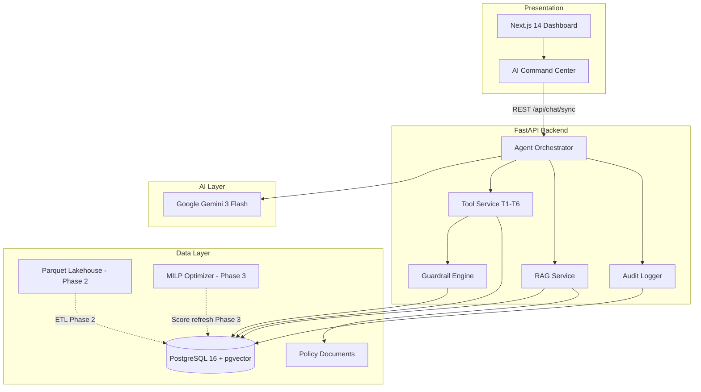
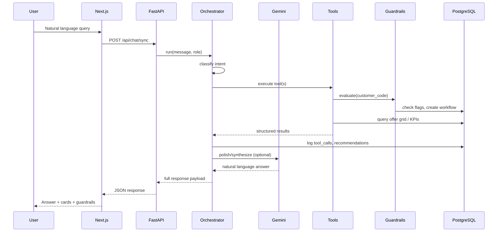

# Settlement Portfolio AI Agent — Project Report

**Document classification:** Executive & Technical Delivery Plan  
**Project:** Decision Intelligence Layer for Debt Settlement Portfolios  
**Version:** 1.0 — Based on MVP codebase & specification analysis  
**Date:** 15 June 2026  
**Prepared for:** Executive sponsors, technical leads, delivery teams, investors

---

## 1. Executive Summary

### Business Problem

The organization manages a large portfolio of distressed borrowers and relies on predictive models (PoAPP, PoA, PoF), a MILP optimization engine, and manual analyst workflows to determine settlement offers. Today, answers to critical questions—*What should we offer borrower 243445?*, *Which segments are underperforming?*, *What if we cap recovery rate at 50%?*—require Python notebooks, batch jobs, and specialist knowledge. This creates latency, inconsistency, compliance risk, and poor scalability.

### Proposed Solution

A **Decision Intelligence Agent**—a governed conversational layer on top of existing ML and optimization infrastructure. Analysts ask questions in plain English; the system orchestrates deterministic tools, enforces compliance guardrails, and returns model-backed, auditable answers.

> **Strategic positioning:** Bloomberg Terminal + governed ChatGPT for Collections & Settlement Management.

### Current State (MVP Delivered)

A working MVP exists in this repository with:

| Capability | Status |
|---|---|
| Next.js 14 dashboard + AI Command Center | Implemented |
| FastAPI backend with 6 tools (T1–T6) | Implemented |
| Deterministic guardrails (deceased, legal entity, RR bounds, vulnerability warnings) | Implemented |
| PostgreSQL + pgvector schema with audit tables | Implemented |
| RAG over 5 policy documents | Implemented (MVP-grade embeddings) |
| 25 mock borrowers with edge cases | Seeded |
| Workflow escalation on guardrail blocks | Implemented |
| Full audit trail (conversations, tool calls, recommendations) | Implemented |
| Docker Compose one-command deployment | Implemented |

### Investment Thesis

The client does **not** need new predictive models. The value is in **orchestration, governance, and democratized access** to existing intelligence. ROI drivers:

- **Operational efficiency:** Reduce analyst time per settlement decision from minutes/hours to seconds.
- **Compliance assurance:** Deterministic guardrails eliminate LLM hallucination on regulatory rules.
- **Portfolio uplift:** Faster what-if analysis and frontier exploration improve EV capture.
- **Audit readiness:** Every recommendation reconstructable from tool-call logs.

### Phase 1 Constraint

**Phase 1 is fixed at 2 weeks** and targets a **investor/demo-ready MVP** on mock data—not production integration.

### Recommended Decision

Proceed with a **phased delivery**: stabilize and demo the existing MVP (Phase 1, 2 weeks), then integrate real data pipelines and enterprise security (Phases 2–4, ~14 additional weeks).

---

## 2. Functional Analysis

### 2.1 Stakeholders & Personas

| Persona | Role | Primary Needs |
|---|---|---|
| **Collections Analyst** | Operational user | Borrower lookup, offer recommendations, explainability |
| **Contact Centre Agent** | Front-line | Policy answers, vulnerability warnings, blocked-case routing |
| **Portfolio Manager** | Tactical | KPIs, segment performance, approval workflows (RR > 60%) |
| **Director / Executive** | Strategic | Portfolio EV vs collections, realization rate, frontier trade-offs |
| **Quant / Strategy Team** | Analytical | What-if constraints, efficient frontier, model monitoring |
| **Compliance / Risk** | Governance | Guardrail enforcement, audit trail, policy RAG |
| **IT / Data Engineering** | Platform | Schema alignment, ETL, API integration |

### 2.2 Business Objectives

1. Replace notebook/script complexity with natural-language access to portfolio intelligence.
2. Never let the LLM compute EV or probabilities—only orchestrate pre-validated tools.
3. Enforce regulatory and operational rules via **deterministic code**, not LLM reasoning.
4. Provide full explainability (model version, SHAP, MIP gap) for every recommendation.
5. Route blocked cases to specialist workflows automatically.

### 2.3 Functional Domains

The specification defines three business domains. Current MVP coverage:

#### Domain 1 — Portfolio Performance

| Function | User Story | MVP Status |
|---|---|---|
| Portfolio KPIs | "Show portfolio KPIs and segment performance" | Done — `portfolio_analytics` tool |
| Realization rate | EV vs actual collections | Done — KPI endpoint |
| Segment drill-down | Underperforming segments | Done — segment table |
| Model drift | PSI, calibration alerts | Done — `monitoring` tool |

#### Domain 2 — Settlement Assignment

| Function | User Story | MVP Status |
|---|---|---|
| Offer recommendation | "What settlement for borrower 243445?" | Done — `offer_optimization` |
| Borrower profile | Lookup by customer/settlement code | Done — `borrower_lookup` |
| Explainability | "Why is acceptance low?" | Done — `explainability` (SHAP) |
| Installment comparison | "Top 5 where 2→1 installment increases EV" | Done — `installment_comparison` |
| Guardrail blocks | Deceased / legal entity | Done — deterministic engine |

#### Domain 3 — Economic Terms / Strategy

| Function | User Story | MVP Status |
|---|---|---|
| Efficient frontier | Conservative / Balanced / Aggressive | Done — `frontier_analysis` |
| Constraint simulation | "RR capped at 50%, P(Fulfill) ≥ 70%" | Partial — keyword-parsed constraints |
| Policy Q&A | "What is max recovery rate?" | Done — RAG + document endpoint |

### 2.4 Agent Tools (T1–T6)

| Tool | Name | Input | Output | Implementation |
|---|---|---|---|---|
| **T1** | Borrower Lookup | `customer_code` / `settlement_code` | Profile, balance, recommended offer | `BorrowerRepository` |
| **T2** | Offer Optimization | `customer_code`, optional constraints | Optimal RR, installments, EV, probabilities | Pre-scored grid lookup (MVP); MILP in production |
| **T3** | Portfolio Analytics | — | KPIs, segments | `PortfolioRepository` |
| **T4** | Frontier Analysis | `min_p_fulfill`, `max_rr` | Frontier curve, scenario delta | `FrontierRepository` |
| **T5** | Monitoring | — | PSI, drift metrics, alerts | `MonitoringRepository` |
| **T6** | Explainability | `customer_code`, `model_name` | Top SHAP drivers | `fact_shap_explanations` |

### 2.5 Guardrails (Compliance-Critical)

Implemented in `GuardrailEngine` as **deterministic pre-checks**:

| Rule | Trigger | Action | Workflow |
|---|---|---|---|
| Deceased borrower | `flag_deceased = 1` | **Hard block** | `deceased_escalation` |
| Legal entity | `flag_legal_entity = 1` | **Hard block** | `corporate_collections` |
| Law protection | `flag_under_law_protection = 1` | **Hard block** | `law_protection_review` |
| RR bounds | RR < 20% or > 80% | **Hard block** | — |
| Vulnerability | `vulnerability_status != 'None'` | **Warning** | Human review recommended |
| Out-of-distribution | `ood_flag = true` | **Warning** | Uncertainty messaging |

### 2.6 UI Modules (Frontend)

| Module | Route | Purpose |
|---|---|---|
| AI Command Center | `/chat` | Conversational agent with tool trace, guardrail panel, recommendation cards |
| Portfolio Dashboard | `/portfolio` | KPIs, segment charts (Recharts) |
| Borrower Detail | `/borrowers/[id]` | Offer grid, optimal offer |
| Strategy | `/strategy` | Efficient frontier visualization |
| Monitoring | `/monitoring` | Model health metrics |
| Documents | `/documents` | Standalone policy RAG |
| Workflows | `/workflows` | Escalation task queue |
| Audit | `/audit` | Recommendation audit trail |

### 2.7 Functional Gaps (MVP → Production)

| Gap | Priority | Phase |
|---|---|---|
| Real data pipeline (Parquet/lakehouse → PostgreSQL) | P0 | Phase 2 |
| Live MILP optimizer integration (HiGHS/OR-Tools) | P0 | Phase 3 |
| LLM-native tool routing (replace keyword intent) | P1 | Phase 2 |
| Production embeddings for RAG (Gemini/OpenAI) | P1 | Phase 2 |
| RBAC / SSO (Azure AD / Okta) | P0 | Phase 2 |
| Streaming chat (SSE endpoint exists, UI not wired) | P2 | Phase 2 |
| Secondary approval workflow (RR > 60%) | P1 | Phase 3 |
| Multi-turn conversation memory | P1 | Phase 3 |
| Confidence intervals on probabilities | P2 | Phase 3 |

---

## 3. Technical Architecture

### 3.1 High-Level Architecture



### 3.2 Request Flow — Settlement Recommendation

```
1. User: "What settlement should we offer borrower 243445?"
2. Intent classifier → "settlement"
3. Extract customer_code → 243445
4. T1: borrower_lookup(243445)
5. T2: offer_optimization(243445)
   └─ GuardrailEngine.evaluate() → passed | blocked | warning
   └─ If blocked → create workflow_task, return escalation message
   └─ If passed → select max EV from fact_offer_grid_scores
6. T6: explainability(243445) → SHAP drivers
7. Persist: agent_tool_calls, agent_recommendations, agent_audit_trail
8. Gemini polish (temperature 0.1, numbers preserved)
9. Response: answer + recommendation + guardrails + tool_calls
```

### 3.3 Data Model

Core entities per `schema.sql`:

- **Dimensions:** `dim_customer`, `dim_region`, `dim_channel`, `dim_product`, `dim_portfolio`
- **Facts:** `fact_settlements_monthly`, `fact_accounts_monthly`, `fact_applications`, `fact_payments`, `fact_activities`
- **AI/Optimization:** `fact_offer_grid_scores`, `fact_recommended_offers`, `fact_efficient_frontier`, `fact_model_monitoring`, `fact_shap_explanations`
- **Agent Governance:** `agent_conversations`, `agent_tool_calls`, `agent_recommendations`, `agent_audit_trail`, `workflow_tasks`
- **RAG:** `document_chunks` (768-dim vectors)

**EV Formula (canonical):**

```
EV = P(Application) × P(Acceptance) × P(Fulfillment) × (Balance × Recovery Rate)
```

### 3.4 Deployment Architecture (MVP)

```yaml
# docker-compose.yml — 3 services
postgres:   pgvector/pgvector:pg16  → port 5432
backend:    FastAPI + seed + uvicorn → port 8000
frontend:   Next.js 14               → port 3000
```

**Startup sequence:** Schema init → `seed_db.py` → RAG ingest on lifespan → API ready.

### 3.5 Target Production Architecture (Phase 4)

```
┌─────────────────────────────────────────────────────────┐
│  Azure / AWS Cloud                                       │
│  ┌──────────┐  ┌──────────┐  ┌──────────────────────┐  │
│  │ CDN/WAF  │→ │ Next.js  │→ │ FastAPI (K8s/ACA)    │  │
│  └──────────┘  └──────────┘  │  ├─ Orchestrator      │  │
│                               │  ├─ Tools             │  │
│  ┌──────────┐  ┌──────────┐  │  └─ Guardrails        │  │
│  │ Azure AD │  │ API GW   │→ └──────────────────────┘  │
│  └──────────┘  └──────────┘           │                 │
│                                        ▼                 │
│  ┌──────────────────┐  ┌─────────────────────────┐   │
│  │ PostgreSQL (HA)    │  │ Blob/S3 (Parquet, docs) │   │
│  │ + pgvector         │  └─────────────────────────┘   │
│  └──────────────────┘                                   │
│  ┌──────────────────┐  ┌─────────────────────────┐   │
│  │ MILP Worker       │  │ Gemini API (VPC egress)  │   │
│  │ (HiGHS batch job) │  └─────────────────────────┘   │
│  └──────────────────┘                                   │
└─────────────────────────────────────────────────────────┘
```

### 3.6 Key Design Principles

1. **LLM orchestrates, never calculates** — All numbers come from tools.
2. **Guardrails are code, not prompts** — Regulatory rules bypass the LLM.
3. **Audit everything** — Tool inputs/outputs, recommendations, events.
4. **Probabilistic language** — "Predicted acceptance probability: 64%", never "will accept".
5. **Fail-safe defaults** — If Gemini unavailable, structured template answers still work.

---

## 4. Technology Stack Recommendations

### 4.1 Current Stack (MVP — Validated)

| Layer | Technology | Version | Rationale |
|---|---|---|---|
| Frontend | Next.js + React + Tailwind | 14.2 | SSR, App Router, fast iteration |
| Charts | Recharts | 2.13 | Lightweight, sufficient for KPIs |
| Backend | FastAPI + Uvicorn | 0.115 | Async, OpenAPI docs, Python ML ecosystem |
| ORM | SQLAlchemy (async) | 2.0 | Mature, asyncpg support |
| Database | PostgreSQL + pgvector | 16 | Single store for relational + vectors |
| LLM | Google Gemini 3 Flash Preview | — | Low latency, cost-effective orchestration |
| Containerization | Docker Compose | — | Reproducible demo environment |

### 4.2 Recommended Production Additions

| Layer | Recommendation | Rationale |
|---|---|---|
| Agent framework | **LangGraph** (already in `requirements.txt`, not yet wired) | Stateful multi-turn, controlled tool routing, human-in-the-loop |
| Tool schemas | **Pydantic AI** or native Gemini function calling | Structured I/O, validation |
| Embeddings | **Gemini `text-embedding-004`** or `text-embedding-3-small` | Replace MVP hash embeddings |
| Auth | **Azure AD / Entra ID** + JWT middleware | Enterprise SSO, RBAC |
| API Gateway | Azure APIM or Kong | Rate limiting, API keys, WAF |
| Observability | **OpenTelemetry** + Grafana/Datadog | Latency, tool-call tracing |
| Model monitoring | **Evidently AI** or WhyLabs | PSI, drift in production |
| MILP solver | **HiGHS** via Pyomo or OR-Tools | Open-source, performant |
| CI/CD | GitHub Actions → ACR/ECR → K8s | Automated testing, deployment |
| Secrets | Azure Key Vault / AWS Secrets Manager | No `.env` in production |

### 4.3 Technology Decisions — Explicitly Avoided

| Option | Why Not (for this project) |
|---|---|
| Replacing PostgreSQL with Pinecone/Weaviate | pgvector sufficient at portfolio scale; reduces ops complexity |
| Building custom LLM | Client has existing ML; agent is orchestration layer |
| LangChain chains (non-graph) | LangGraph preferred for deterministic workflow control |
| Python 3.14 (Windows local) | `asyncpg` wheel incompatibility; use Docker or Python 3.12 |

---

## 5. Detailed Development Roadmap

### Phase 1 — Demo-Ready MVP Stabilization (2 Weeks)

**Goal:** Investor/client demo on mock data, zero critical bugs.

| Week | Deliverable | Owner | Acceptance Criteria |
|---|---|---|---|
| **W1 D1–D2** | Demo script hardening | Full stack | All 6 demo steps in README pass reliably |
| **W1 D3–D4** | UI polish: guardrail panels, workflow banners, recommendation cards | Frontend | Edge cases 243450–243453 render correctly |
| **W1 D5** | Error handling + loading states | Frontend | Graceful Gemini API failure |
| **W2 D1–D2** | Intent classifier expansion + test queries | Backend | 20 golden queries classified correctly |
| **W2 D3** | Audit trail UI completeness | Frontend | Recommendations visible in `/audit` |
| **W2 D4** | Docker reliability (seed reset, health checks) | DevOps | `docker compose up --build` works first try |
| **W2 D5** | Demo rehearsal + documentation | PM | Recorded walkthrough, stakeholder sign-off |

**Phase 1 exit criteria:**

- Demo script executes in < 10 minutes without failure
- All 4 edge cases demonstrate guardrail behavior
- Audit trail reconstructs hero borrower 243445 recommendation

---

### Phase 2 — Data Integration & Security Foundation (4 Weeks)

| Deliverable | Details |
|---|---|
| ETL pipeline | Ingest `prescored_borrower_offer_grid`, `recommended_offers_3l_v3`, monitoring baselines from Parquet |
| Schema alignment | Map production column names to `dim_*` / `fact_*` tables |
| Production RAG | Gemini embeddings, chunk metadata, source citations |
| Authentication | Azure AD SSO, JWT middleware, role-based route guards |
| API hardening | Rate limiting, input validation, CORS lockdown |
| Observability | Structured logging, request tracing |

---

### Phase 3 — Intelligence Layer Maturity (6 Weeks)

| Deliverable | Details |
|---|---|
| LangGraph orchestrator | Replace keyword intent with structured tool-calling graph |
| Live MILP integration | HiGHS solver for on-demand re-optimization |
| Multi-turn memory | Conversation context across turns |
| Streaming chat | Wire SSE `/api/chat` to frontend |
| Confidence intervals | Display ±CI on all probabilities |
| Secondary approval | RR > 60% → Portfolio Manager workflow |
| Expanded tool chaining | T3 → T2 → T6 multi-step queries via graph |

---

### Phase 4 — Production Hardening & Go-Live (4 Weeks)

| Deliverable | Details |
|---|---|
| Security audit | Pen test, OWASP review, secrets rotation |
| Performance testing | 50 concurrent users, p95 < 3s for chat |
| UAT with collections team | 2-week parallel run vs existing process |
| DR/backup | PostgreSQL HA, RPO < 1h |
| Runbooks | Incident response, model refresh, document ingest |
| Go-live | Phased rollout: 10% → 50% → 100% analysts |

---

## 7. AI Implementation Guide

### 7.1 AI Architecture

```
┌─────────────────────────────────────────────────────┐
│                  ORCHESTRATION LAYER                 │
│  ┌─────────────┐    ┌──────────────┐                │
│  │ Intent       │ →  │ Tool Router  │               │
│  │ (keyword→    │    │ (T1-T6 +     │               │
│  │  LangGraph)  │    │  document_rag)│               │
│  └─────────────┘    └──────────────┘                │
│         │                    │                       │
│         ▼                    ▼                       │
│  ┌─────────────┐    ┌──────────────┐                │
│  │ LLM Synthesis│    │ Guardrails   │ (deterministic)│
│  │ (Gemini)     │    │ Engine       │                │
│  └─────────────┘    └──────────────┘                │
└─────────────────────────────────────────────────────┘
```

**Current MVP:** Keyword-based intent + template answers + Gemini polish/synthesis.  
**Target:** LangGraph state machine with Gemini function calling.

### 7.2 Model Selection Rationale

| Use Case | Model | Rationale |
|---|---|---|
| **Orchestration & synthesis** | Gemini 3 Flash Preview | Fast, cost-effective, sufficient for tool routing and prose generation |
| **Complex multi-step reasoning** | Gemini 3 Pro (fallback) | Higher accuracy for ambiguous queries |
| **Embeddings (production)** | `text-embedding-004` | Native Google stack, 768-dim aligns with schema |
| **Predictions (existing)** | PoAPP, PoA_v3.1, PoF (RSF) | **Not replaced** — pre-computed in offer grid |

**Why not GPT-4/Claude for primary orchestration?** Gemini is already integrated, meets latency requirements, and keeps the Google Cloud stack cohesive. Claude/GPT can be evaluated in Phase 3 as A/B alternatives.

### 7.3 Data Flow



### 7.4 RAG Implementation

**Current (MVP):**

```python
# Deterministic hash-based pseudo-embedding — adequate for demo only
EMBED_DIM = 768
# Chunking: 400-char paragraphs from content/docs/*.md
# Retrieval: cosine similarity, top_k=3
# Synthesis: Gemini with policy context
```

**Production target:**

| Step | Implementation |
|---|---|
| Ingest | Watch `content/docs/` + model cards + historical analyses |
| Chunk | 512 tokens, 64-token overlap, preserve headings |
| Embed | Gemini `text-embedding-004` → `vector(768)` |
| Index | pgvector IVFFlat or HNSW index |
| Retrieve | Hybrid: vector + BM25 keyword |
| Rerank | Cross-encoder or Gemini rerank |
| Generate | Grounded synthesis with mandatory source citations |
| Guard | Reject answers when retrieval score < 0.7 |

**Policy corpus (current):**

- `recovery-rate-policy.md` — RR 20–80%, approval > 60%
- `deceased-borrower-policy.md` — hard block + escalation
- `corporate-collections-policy.md` — legal entity routing
- `vulnerability-policy.md` — warning + human review
- `poa-model-card.md` — model metadata for grounded answers

### 7.5 Agent Architecture (Target — LangGraph)

```python
# Proposed graph nodes (Phase 3)
graph = StateGraph(AgentState)
graph.add_node("classify", classify_intent)
graph.add_node("route", route_to_tools)
graph.add_node("execute_tools", execute_tool_chain)
graph.add_node("guardrails", run_guardrails)
graph.add_node("synthesize", llm_synthesize)
graph.add_node("audit", persist_audit)

graph.add_edge("classify", "route")
graph.add_conditional_edges("route", tool_selector)
graph.add_edge("execute_tools", "guardrails")
graph.add_conditional_edges("guardrails", blocked_or_continue)
graph.add_edge("synthesize", "audit")
```

**Human-in-the-loop insertion point:** After guardrail `warning` status, pause for analyst confirmation before contact recommendation.

### 7.6 Prompt Engineering Strategy

**System prompt (production-hardened extension of current):**

```
ROLE: Decision Intelligence Agent for debt settlement portfolios.

INVARIANTS:
1. NEVER calculate EV, probabilities, or recovery rates yourself.
2. ALWAYS use tools for numerical data.
3. ALWAYS use probabilistic language ("Predicted...", "Model indicates...").
4. NEVER present predictions as certainties.
5. If guardrails block → explain reason + mention workflow escalation.
6. Include model version, MIP gap, and probabilities in every recommendation.
7. For policy questions → cite document name and section.

OUTPUT FORMAT:
- Lead with the direct answer.
- Follow with supporting metrics (bulleted).
- End with guardrail status and any warnings.
```

| Prompt Type | Temperature | Purpose |
|---|---|---|
| Tool routing | 0.0 | Deterministic tool selection |
| Answer polish | 0.1 | Preserve exact numbers |
| RAG synthesis | 0.2 | Balanced grounding + readability |
| Explainability narrative | 0.3 | Natural SHAP interpretation |

**Anti-hallucination controls:**

- Numbers only from tool output JSON (validated by Pydantic)
- Post-generation regex check: any number in answer must exist in tool output
- Policy answers must include `sources[].document_name`

### 7.7 Evaluation Metrics

| Category | Metric | Target | Measurement |
|---|---|---|---|
| **Correctness** | Golden query accuracy | ≥ 95% | 50-query benchmark set |
| **Guardrails** | Block precision/recall | 100% / 100% | Edge case suite (243450–243453) |
| **RAG** | Answer groundedness | ≥ 90% | Human eval + citation check |
| **Latency** | p95 chat response | < 3s | APM tracing |
| **Tool routing** | Intent classification accuracy | ≥ 92% | Confusion matrix on labeled queries |
| **Safety** | Hallucinated number rate | 0% | Automated number-validation |
| **UX** | Demo script pass rate | 100% | Manual checklist |
| **Business** | Analyst time-to-answer | < 30s vs baseline | User study (Phase 4) |

**Golden query examples (from demo script):**

1. "What settlement should we offer borrower 243445?" → 60% RR, 2 inst, EV £1,425
2. "Recommend offer for borrower 243450" → Blocked, deceased_escalation
3. "What is the max recovery rate?" → 20–80% from policy
4. "Show portfolio KPIs" → KPI values from T3
5. "Show efficient frontier" → 3 strategies from T4

---

## 8. Security & Compliance

### 8.1 Current MVP Security Posture

| Control | Status | Risk |
|---|---|---|
| Authentication | None (role selector UI only) | **High** |
| API authorization | Open endpoints | **High** |
| CORS | `localhost:3000` only | Acceptable for dev |
| Secrets | `.env` file | **Medium** — must use vault in prod |
| Audit logging | Implemented (DB) | Good foundation |
| Guardrails | Deterministic code | **Strong** |
| PII in logs | Customer codes logged | Review for prod |
| Encryption at rest | Docker volume default | Needs cloud KMS |
| Encryption in transit | Not enforced (HTTP local) | TLS required in prod |

### 8.2 Production Security Requirements

| Domain | Requirement | Implementation |
|---|---|---|
| **Identity** | SSO + MFA | Azure AD / Entra ID |
| **Authorization** | RBAC by persona | Analyst, Manager, Admin, Read-only |
| **API** | JWT validation on all `/api/*` | FastAPI middleware |
| **Data** | PII minimization in prompts | Send only necessary fields to Gemini |
| **LLM** | No PII in training | Enterprise Gemini API (no training on data) |
| **Audit** | Immutable audit trail | Append-only `agent_audit_trail`, 7-year retention |
| **Network** | Private endpoints | VNet/VPC, no public DB |
| **Secrets** | Rotation policy | Key Vault, 90-day rotation |
| **Compliance** | FCA/regulatory alignment | Guardrails mirror policy docs |
| **Vulnerability** | Dependency scanning | Dependabot, Snyk in CI |

### 8.3 Regulatory Alignment

| Regulation / Policy | System Control |
|---|---|
| Recovery rate 20–80% | `GuardrailEngine` RR_MIN/RR_MAX |
| Deceased borrower handling | Hard block + `deceased_escalation` workflow |
| Vulnerable customer treatment | Warning + restricted messaging |
| Model explainability | SHAP drivers + model card RAG |
| Audit reconstruction | `agent_recommendations` + `agent_tool_calls` |
| RR > 60% secondary approval | Phase 3 workflow (policy-defined) |

### 8.4 Data Classification

| Data Type | Classification | Handling |
|---|---|---|
| Customer codes, balances | Confidential | Encrypted at rest, RBAC |
| Model scores | Internal | Tool output only, not in prompts unnecessarily |
| Policy documents | Internal | RAG corpus, version-controlled |
| Audit logs | Regulatory | Immutable, long retention |
| Gemini API payloads | Confidential | Enterprise API tier, no retention |

---

## 9. Timeline

### Master Schedule

```
Phase 1 ████████████████                          2 weeks  (Demo MVP)
Phase 2                 ████████████████████████████  4 weeks  (Data + Auth)
Phase 3                                             ██████████████████████████████████████  6 weeks  (AI Maturity)
Phase 4                                                                                   ████████████████████████████  4 weeks  (Go-Live)
        |----2w----|----4w----|--------6w--------|----4w----|
        Week 1-2   Week 3-6   Week 7-12            Week 13-16
```

### Phase 1 — Detailed 2-Week Sprint Plan

| Day | Activity | Milestone |
|---|---|---|
| **D1** | Stakeholder alignment, demo script review | Signed demo scope |
| **D2** | Fix seed/DB reliability, health endpoint validation | Clean `docker compose up` |
| **D3** | Frontend: guardrail panel + workflow banner QA | Edge cases visual |
| **D4** | Backend: golden query test suite (manual) | 20 queries pass |
| **D5** | Recommendation card + audit page polish | End-to-end trace visible |
| **D6** | Error states, Gemini fallback testing | Graceful degradation |
| **D7** | Role-based UI filtering (analyst vs manager views) | Role demo ready |
| **D8** | Performance pass (response times) | p95 < 5s on mock |
| **D9** | Documentation: demo guide, architecture one-pager | Investor pack |
| **D10** | Full demo rehearsal × 3 | Zero-failure demo |

**Phase 1 team (minimal):** 1 full-stack developer, 0.5 PM, 0.25 architect (review only).

---

## 10. Testing Strategy

### 10.1 Testing Pyramid

```
                    ┌─────────┐
                    │  E2E    │  Demo script, Playwright
                   ┌┴─────────┴┐
                   │ Integration │  API + DB + tools
                  ┌┴───────────┴┐
                  │    Unit      │  Guardrails, intent, EV formula
                  └──────────────┘
```

### 10.2 Test Categories

| Layer | Scope | Tools | Phase |
|---|---|---|---|
| **Unit** | GuardrailEngine rules, intent classifier, EV calculation | pytest | Phase 1 |
| **Integration** | Tool service → DB, RAG ingest/query | pytest + testcontainers | Phase 2 |
| **API** | All endpoints, error codes, validation | pytest + httpx | Phase 2 |
| **Golden queries** | 50 labeled NL queries → expected tool/intent/output | Custom harness | Phase 1–3 |
| **Guardrail suite** | All 4 edge cases + RR bounds | Automated | Phase 1 |
| **RAG accuracy** | Policy Q&A with expected citations | Manual + automated | Phase 2 |
| **E2E** | Demo script flow in browser | Playwright | Phase 1 |
| **Load** | 50 concurrent chat requests | k6 or Locust | Phase 4 |
| **Security** | OWASP ZAP, pen test | External vendor | Phase 4 |
| **UAT** | Collections analyst parallel run | Manual | Phase 4 |

### 10.3 Critical Test Cases (Phase 1 — Must Pass)

| ID | Query / Action | Expected Result |
|---|---|---|
| TC-01 | Offer for 243445 | 60% RR, 2 inst, EV £1,425, model v3.2 |
| TC-02 | Offer for 243450 | Blocked, deceased_escalation workflow created |
| TC-03 | Offer for 243451 | Blocked, corporate_collections workflow |
| TC-04 | Offer for 243452 | Warning: VulnerabilityStatus |
| TC-05 | Offer for 243453 | Warning: OutOfDistribution |
| TC-06 | Max recovery rate policy | 20–80% with source citation |
| TC-07 | Portfolio KPIs | Non-zero EV, realization rate |
| TC-08 | Efficient frontier | 3 strategies returned |
| TC-09 | Top 5 installment comparison | Ranked list with EV deltas |
| TC-10 | SHAP explain 243445 | Top positive/negative features |

### 10.4 CI/CD Pipeline (Phase 2+)

```yaml
on: [push, pull_request]
jobs:
  backend-test:
    - pytest tests/ --cov=app --cov-min=80
  frontend-lint:
    - npm run lint && npm run build
  guardrail-suite:
    - pytest tests/guardrails/ -v
  docker-build:
    - docker compose build
  golden-queries:
    - python scripts/run_golden_queries.py --threshold 0.95
```

---

## 11. Risk Assessment

### 11.1 Technical Risks

| Risk | Likelihood | Impact | Mitigation |
|---|---|---|---|
| LLM hallucinates numbers | Medium | Critical | Numbers only from tools; post-validation regex; guardrails in code |
| Gemini API outage/latency | Medium | High | Template fallback answers; circuit breaker; response caching for KPIs |
| Keyword intent misroutes queries | High | Medium | Phase 2: LangGraph + function calling; golden query monitoring |
| MVP pseudo-embeddings fail on new policies | High | Medium | Phase 2: production embeddings + hybrid retrieval |
| `asyncpg` / Python version incompatibility | Medium | Low | Docker-first development; pin Python 3.12 |
| Mock data diverges from production schema | Medium | High | Phase 2: schema mapping document; incremental real data load |
| pgvector scale limits | Low | Medium | IVFFlat indexing; evaluate dedicated vector DB at >1M chunks |

### 11.2 Business Risks

| Risk | Likelihood | Impact | Mitigation |
|---|---|---|---|
| Analysts distrust AI recommendations | Medium | High | Show tool trace, SHAP, model version; probabilistic language |
| Compliance rejects LLM for recommendations | Medium | Critical | Guardrails are deterministic code; LLM only orchestrates/polishes |
| Scope creep into building new ML models | Medium | Medium | Fixed scope: orchestration layer only; MILP integration reads existing scores |
| Demo impresses but production timeline slips | Medium | High | Phase 1 locked to 2 weeks; phased contract with clear exit criteria |
| Regulatory change to RR bounds | Low | Medium | Policy docs in RAG + configurable `RR_MIN`/`RR_MAX` constants |

### 11.3 Resource Risks

| Risk | Likelihood | Impact | Mitigation |
|---|---|---|---|
| No access to production data pipelines | Medium | High | Phase 1 on mock; Phase 2 gated on data access agreement |
| Limited ML engineering availability | Medium | Medium | MVP reads pre-scored grid; MILP integration deferred to Phase 3 |
| Single developer dependency | High | High | Documentation, Docker, golden tests; pair on critical paths |
| Gemini API key / budget constraints | Low | Medium | Flash model is low-cost; cache KPI queries; set billing alerts |

### 11.4 Mitigation Summary

1. **Compliance-first architecture** — Guardrails never touch the LLM.
2. **Phased delivery** — Demo value in 2 weeks; production risk spread across 16 weeks.
3. **Golden query regression** — Automated gate on every deployment.
4. **Docker reproducibility** — Eliminates environment drift.
5. **Clear scope boundary** — Agent orchestrates; does not replace ML team deliverables.

---

## 12. Devis (Minimal Budget)

*Estimates in EUR, lean team, remote/hybrid delivery. Excludes client-side data engineering and infrastructure licenses the client already holds.*

### 12.1 Phase 1 — Demo MVP (2 Weeks)

| Item | Days | Rate | Cost |
|---|---|---|---|
| Full-Stack Developer | 10 | €500/day | €5,000 |
| Technical PM (part-time) | 3 | €600/day | €1,800 |
| Solution Architect (review) | 1 | €800/day | €800 |
| **Phase 1 Subtotal** | | | **€7,600** |

### 12.2 Phases 2–4 — Production (14 Weeks)

| Item | Days | Rate | Cost |
|---|---|---|---|
| Backend Developer (Python/FastAPI) | 40 | €500/day | €20,000 |
| Frontend Developer (Next.js) | 25 | €480/day | €12,000 |
| ML/Data Engineer (part-time) | 15 | €550/day | €8,250 |
| DevOps / Cloud Engineer (part-time) | 10 | €550/day | €5,500 |
| Solution Architect | 8 | €800/day | €6,400 |
| QA Engineer (part-time) | 12 | €450/day | €5,400 |
| Technical PM | 20 | €600/day | €12,000 |
| **Phases 2–4 Subtotal** | | | **€69,550** |

### 12.3 Infrastructure & Services (Annual Estimate)

| Item | Monthly | Annual |
|---|---|---|
| Cloud hosting (Azure ACA / AWS ECS + RDS) | €400 | €4,800 |
| Gemini API (est. 50K queries/month, Flash) | €150 | €1,800 |
| Monitoring (Grafana Cloud / Datadog basic) | €100 | €1,200 |
| CI/CD (GitHub Actions) | €0–50 | €600 |
| **Infrastructure Subtotal** | **€650–700** | **€8,400** |

### 12.4 Total Investment Summary

| Phase | Duration | Cost |
|---|---|---|
| **Phase 1** — Demo MVP | 2 weeks | **€7,600** |
| **Phases 2–4** — Production | 14 weeks | **€69,550** |
| **Infrastructure** (Year 1) | 12 months | **€8,400** |
| **Contingency** (10%) | — | **€7,755** |
| **TOTAL (minimal)** | **16 weeks + 12 months ops** | **€93,305** |

### 12.5 Optional Add-Ons (Not in Minimal Budget)

| Add-On | Est. Cost |
|---|---|
| External penetration test | €5,000–€8,000 |
| Evidently AI model monitoring license | €3,000/year |
| 24/7 support retainer | €2,000/month |
| Additional policy document corpus ingestion (50+ docs) | €3,000 |

### 12.6 ROI Sketch (For Investors)

| Assumption | Value |
|---|---|
| Collections analysts affected | 20 |
| Minutes saved per settlement query | 15 min |
| Queries per analyst per day | 10 |
| Working days per year | 220 |
| Analyst fully-loaded cost | €45/hour |
| **Annual time savings** | 20 × 10 × 15min × 220 = **11,000 hours** |
| **Annual value** | 11,000 × €45 × 0.5 efficiency factor = **~€247,500** |
| **Payback period** | < 6 months against total project cost |

---

## Appendices

### A. API Surface (Implemented)

| Method | Path | Description |
|---|---|---|
| POST | `/api/chat/sync` | Synchronous agent chat |
| POST | `/api/chat` | SSE streaming chat |
| GET | `/api/borrowers/{id}` | Borrower profile |
| GET | `/api/portfolio/kpis` | Portfolio KPIs |
| GET | `/api/frontier` | Efficient frontier |
| GET | `/api/monitoring` | Model health |
| POST | `/api/documents/query` | RAG document Q&A |
| GET | `/api/workflows` | Escalation tasks |
| GET | `/api/audit/recommendations` | Audit trail |

### B. Demo Script (Validated Against Codebase)

1. Select **Collections Analyst** role
2. Ask: `What settlement should we offer borrower 243445?` → 60% RR / 2 installments
3. Ask: `Recommend offer for borrower 243450` → Guardrail block + workflow
4. Open **Portfolio Dashboard** → KPIs + segments
5. Open **Borrower 243445** → offer grid
6. **Documents:** `What is the max recovery rate?` → 20–80%

### C. Immediate Next Actions (Phase 1 Kickoff)

1. Run and validate `docker compose up --build` on demo machine
2. Create `tests/guardrails/` with TC-01 through TC-06
3. Record baseline demo video for regression comparison
4. Secure Gemini API key with billing alerts
5. Schedule stakeholder demo for end of Week 2

---

*This report is grounded in the existing MVP codebase (`backend/`, `frontend/`, `content/`), the [decision-intelligence-agent-specification.md](./decision-intelligence-agent-specification.md), and the implemented architecture described in the [README.md](../README.md). Phase 1 is scoped strictly to **2 weeks** on mock data; production integration begins in Phase 2.*
